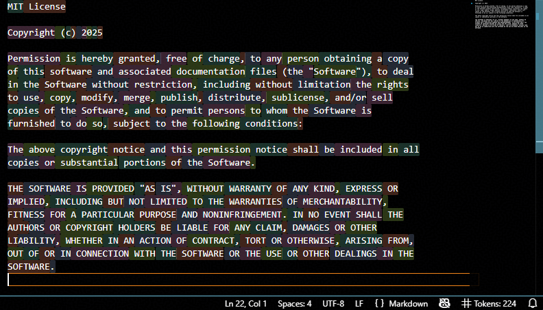

# Local Token Visualizer

Local Token Visualizer is a VS Code extension for counting and visualizing LLM tokens offline with a local Hugging Face tokenizer directory.



## What It Does

- Counts tokens for the active editor using a local tokenizer.
- Highlights visible token ranges with a five-color overlay.
- Runs offline after the tokenizer files are present locally.
- Updates immediately for smaller files and debounces larger files.
- Lets you toggle highlighting from the status bar.

## Setup

The extension needs a Hugging Face tokenizer directory containing `tokenizer.json`.

For local development in this repository, the default path points to:

```text
C:\GIT_REPO\Local_Token_Visualizer\tokenizer
```

To choose another tokenizer:

1. Open the Command Palette with `Ctrl+Shift+P`.
2. Run `Local Token Visualizer: Select Tokenizer Directory`.
3. Pick a folder that contains `tokenizer.json`.

You can also set the path manually in VS Code settings:

```json
"localTokenizer.modelPath": "C:/path/to/tokenizer"
```

## Controls

| Control | Action |
| --- | --- |
| Status bar `Tokens: N` | Click to toggle token highlighting on or off. |
| `Local Token Visualizer: Select Tokenizer Directory` | Opens a folder picker and saves `localTokenizer.modelPath`. |
| `Local Token Visualizer: Toggle Highlighting` | Toggles `localTokenizer.enableHighlighting`. |

When highlighting is off, the status bar shows `Tokens: N (highlight off)`.

## Settings

| Setting | Default | Description |
| --- | --- | --- |
| `localTokenizer.modelPath` | bundled dev tokenizer path | Absolute path to a tokenizer directory containing `tokenizer.json`. |
| `localTokenizer.enableHighlighting` | `true` | Enables or disables token overlay highlighting. |
| `localTokenizer.smallFileThreshold` | `50000` | Files at or below this character count update immediately instead of waiting for debounce. |

## Package Size Notes

The extension currently uses `@huggingface/transformers` for local tokenizer loading. Even tokenizer-only usage imports the package's Node ONNX backend at module load time, so the matching `onnxruntime-node` native files must remain packaged for this dependency to load correctly.

The package excludes unused debug/source artifacts and the browser ONNX runtime to keep the VSIX smaller. A future version can shrink further by replacing `@huggingface/transformers` with a tokenizer-only dependency.

## Local Development

```powershell
npm install
npm run compile
npm test
npm run lint
npm run test:vscode
npm run package
```

Install the packaged VSIX locally:

```powershell
code --install-extension C:\GIT_REPO\Local_Token_Visualizer\local-token-visualizer-0.0.2.vsix
```
